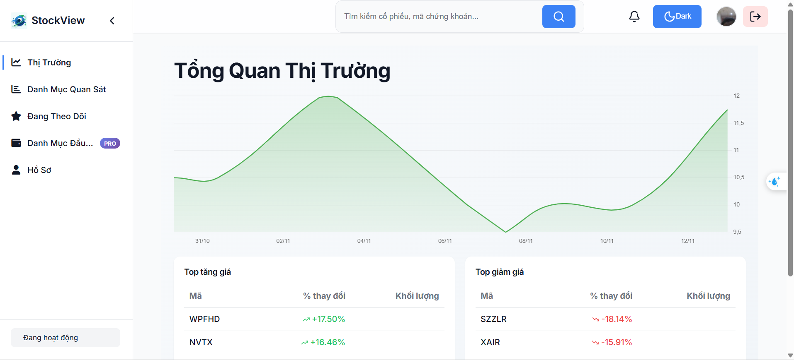
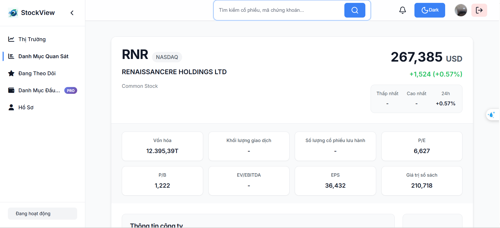
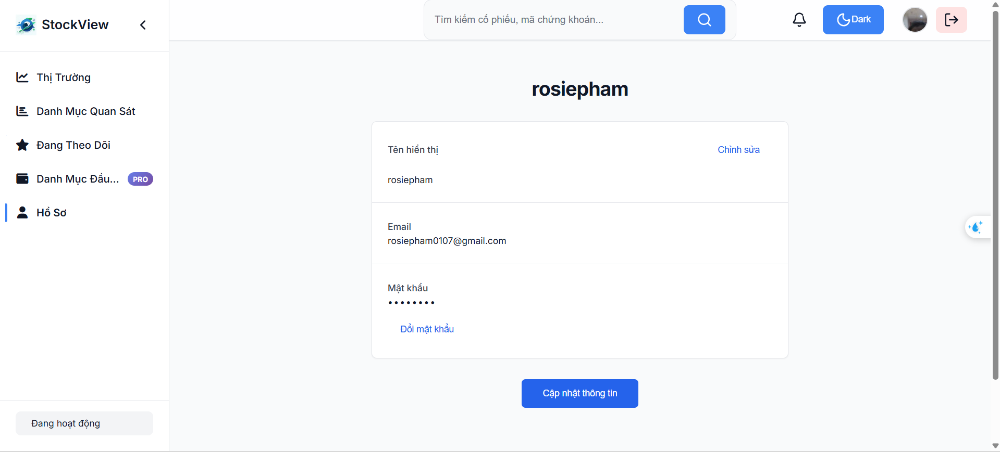
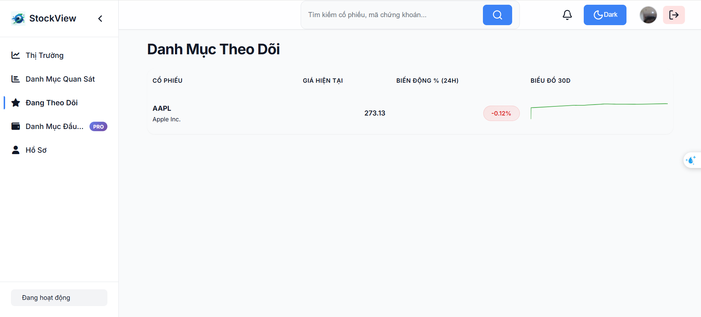
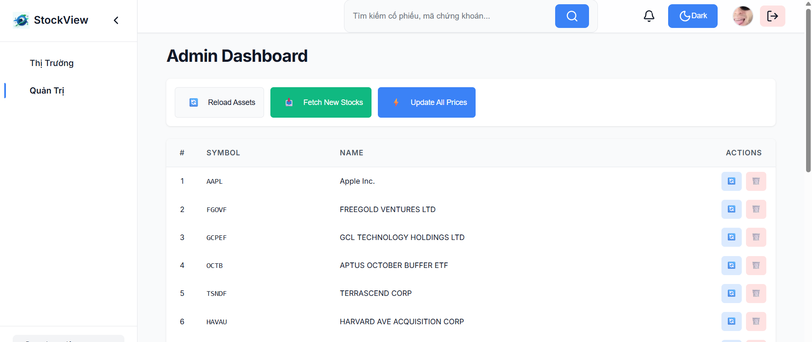
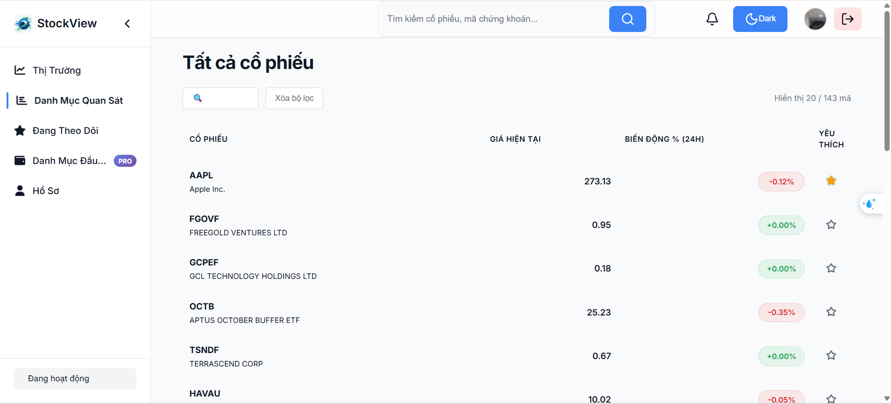

# StockView – Financial Market Analysis & Tracking System  

Full‑stack application for tracking and analyzing financial markets including stocks, crypto.  
Backend: **Spring Boot (Java)** | Frontend: **React + TypeScript**  

---

## 📌 Description  
StockView allows users to:  
- Register/Login (supports OAuth2 with Google)  
- Manage assets such as stocks, crypto, and metals  
- Retrieve real‑time price data from third‑party APIs (e.g., Finnhub)  
- Store price history and generate charts/statistics  
- Manage watchlists  
- Handle authorization with user/admin roles  
- Use a responsive frontend with modern UI and theme toggle  

---

## 🧱 Architecture  

**Backend** – Java + Spring Boot (3.x)  
- Spring Web, Spring Data JPA, PostgreSQL, Redis (cache & session)  
- Spring Security + JWT + OAuth2 (Google)  
- RESTful API + WebSocket endpoint (`WS_URL`)  
- External API integration: Finnhub (stocks)  
- Logging, exception handling, Swagger UI (OpenAPI)  

**Frontend** – React + TypeScript + Vite  
- Clear component architecture: layout, sidebar, modals, pages, store (zustand/mobx)  
- Tables, charts, dark/light mode theme toggle  
- UI for both user and admin (asset management)  

**Database**  
- PostgreSQL (runs locally)  
---

## 🚀 Install & Run

### 1️⃣ Create environment variables

Copy `.env.example` and fill in your values:

```bash
cp .env.example .env
```

> Important variables:
>
> * PostgreSQL: `POSTGRES_USER`, `POSTGRES_PASSWORD`, `POSTGRES_DB`
> * Finnhub API: `FINNHUB_API_KEY`
> * OAuth2 Google: `GOOGLE_CLIENT_ID`, `GOOGLE_CLIENT_SECRET`

---

### 2️⃣ Run Backend (with Frontend Included)

The frontend is already built and included in the backend, so you only need to start the backend:

```bash
cd backend
./mvnw clean package
java -jar target/backend-1.0-SNAPSHOT.jar
```

Or run directly in **IntelliJ** using `Main.java`.

Open your browser at: `http://localhost:8080`

> Note: The frontend is served directly by the backend; no separate development server is required.

---

⚠️ Prerequisite

Make sure Docker Desktop (Windows/macOS) or Docker Engine (Linux) is running before starting the project.

### 3️⃣ Run using start script (Windows/macOS/Linux)

* **Windows:** double-click `start.bat`
* **Linux/macOS:** `./start.sh` (after `chmod +x start.sh`)

The script will automatically run **backend + frontend + PostgreSQL** via Docker Compose.

---

### 4️⃣ Run using Docker Compose (terminal)

You can also run everything directly via terminal:

```bash
docker compose up --build
```

* This will start all containers: backend, frontend, PostgreSQL.
* Access the app at: `http://localhost:8080`
* Swagger UI: `http://localhost:8080/swagger-ui.html`

---

### 5️⃣ Stop the project

```bash
docker compose down
```

This stops all containers and removes the default networks created by Docker Compose.

---


## 🧩 Main Features  

**User Features**  
- Register/login & JWT‑based authentication  
- OAuth2 with Google  
- Profile and role management  

**Asset Features**  
- Add, delete, check existence of assets  
- Retrieve real‑time prices and save price history  
- View charts for stocks, crypto, metals  
- Manage watchlist  
- Statistics: min, max, average prices  

**Admin Features**  
- Add/edit/delete assets  
- Track new market entries  
- API documentation via Swagger UI (`http://localhost:8080/swagger-ui.html`)  

---

## 🧪 Testing  
- Backend has unit and integration tests (e.g., `AuthControllerIntegrationTest.java`, `UserServiceTest.java`)  

---

## 📁 Directory Structure  
```text
/backend  
├─ src/main/java/com/recognition/…  
├─ src/main/resources/application.properties  
├─ .env  
├─ pom.xml  

/frontend  
├─ src/components  
├─ src/pages  
├─ src/store  
├─ src/utils  
├─ package.json  
├─ vite.config.ts  

.env.example  
````

---
## 🖼 Screenshots

### Dashboard


### Stock Detail


### User Profile


### Favorites / Watchlist


### Admin Panel


### Stock Management

---

## 📩 Contact

If you encounter any problems or want to contribute:

* Open an issue on GitHub